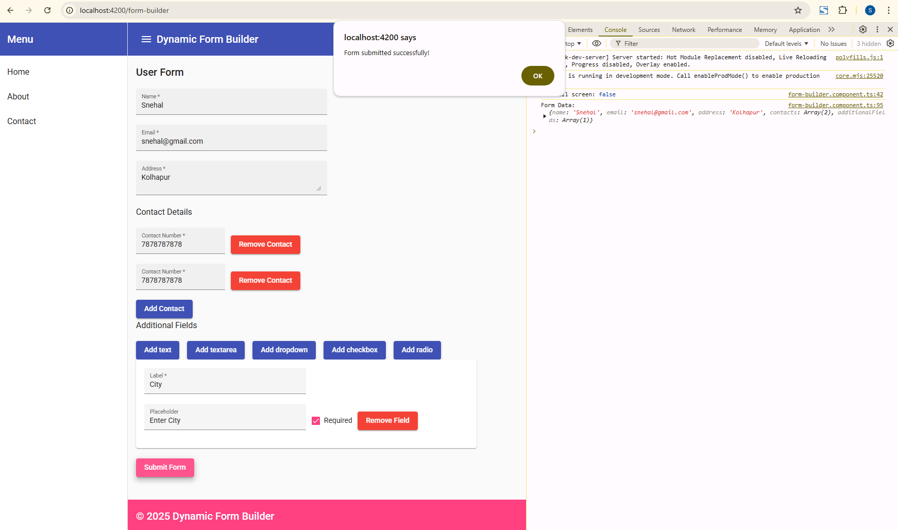
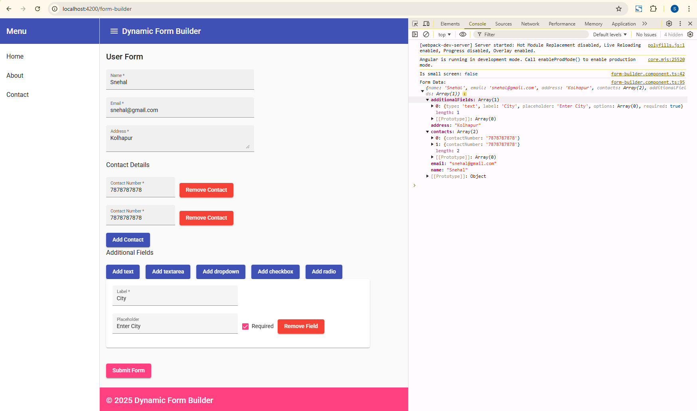
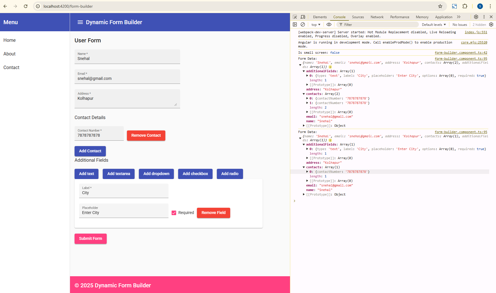

# DynamicFormBuilder
This project is a Dynamic Form Builder application developed in Angular. It allows users to dynamically add fields to a form, including text inputs, textareas, dropdowns, checkboxes, and radio buttons, as well as manage contacts and additional dynamic fields. It also includes a responsive UI with Material Design components.
# Features
1. Dynamically add and remove form fields.
2. Supports different field types like text, textarea, dropdown, checkbox, and radio.
3. Responsive layout with a sidebar and header.
4. Form validation for required fields, email format, and numeric contact numbers.
5. Built with Angular and Angular Material for UI components.

This project was generated with [Angular CLI](https://github.com/angular/angular-cli) version 14.2.13.

# Prerequisites
Before running the project, ensure that you have the following installed on your system:

`Node.js (Version 16)`
`Angular CLI (Version 14 )`

# Installation and Running Locally
1. Clone the Repository
Open your terminal or command prompt and run the following command:
`git clone https://github.com/<your-username>/<your-repository-name>.git`

2. Navigate to the Project Directory
`cd <your-repository-name>`

3. Install Dependencies
Install the required npm packages by running:
`npm install`

4. Start the Development Server
Run the following command to start the application locally:
`ng serve`

## Development server

Run `ng serve` for a dev server. Navigate to `http://localhost:4200/`. The application will automatically reload if you change any of the source files.

## Further help

To get more help on the Angular CLI use `ng help` or go check out the [Angular CLI Overview and Command Reference](https://angular.io/cli) page.

## Demo Images

Display Success Message After Successful submission.

After form submission logs the form data to the console.

Dynamic Updating of the form as the user adds or removes fields without page refresh.

